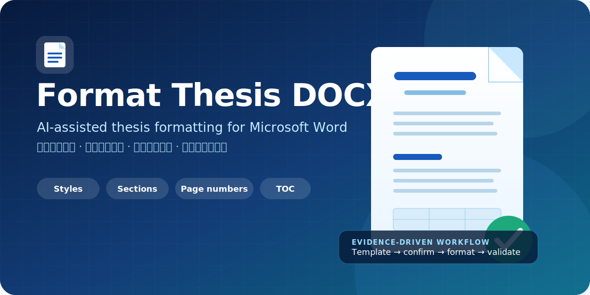
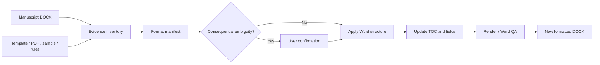

# Format Thesis DOCX

<p align="center">
  
</p>

<p align="center">
  <strong>University template in. Validated Word thesis out.</strong><br />
  A Codex skill and Microsoft Word task pane for evidence-driven thesis and dissertation formatting.
</p>

<p align="center">
  <a href="https://github.com/h46373824-tech/format-thesis-docx-skill/actions/workflows/validate.yml"></a>
  <a href="LICENSE"></a>
  <a href="https://github.com/h46373824-tech/format-thesis-docx-skill/stargazers"></a>
  
  
</p>

<p align="center">
  <a href="#quick-start">Quick start</a> ·
  <a href="#what-it-formats">Capabilities</a> ·
  <a href="docs/validation.md">Validation evidence</a> ·
  <a href="#中文快速开始">中文快速开始</a> ·
  <a href="office-addin/README.md">Word Add-in</a>
</p>

> **Important:** this project formats documents; it does not verify academic claims or guarantee compliance with every university. Always retain the original manuscript and review the generated copy against the official rules.

## Why this project

Thesis formatting is not a single “change font” operation. A reliable workflow must reconcile official guides, Word templates, approved samples, cover metadata, heading hierarchy, section breaks, Roman/Arabic page numbering, headers, footers, tables and a live table of contents.

Format Thesis DOCX turns those sources into an auditable format manifest, applies high-confidence rules automatically, and pauses only when a consequential requirement is ambiguous or conflicting.



## What it formats

| Area | What the workflow handles |
| --- | --- |
| Formatting evidence | Official DOCX/DOTX templates, approved samples, PDFs, screenshots and written rules |
| Cover | Metadata mapping for title, author, student ID, school, major, supervisor, degree and date |
| Page layout | A4/Letter, orientation, margins, section breaks and intentional blank pages |
| Typography | East Asian and Latin fonts, body styles, headings, captions, quotations, notes and references |
| Structure | Real Heading styles, outline levels and true multilevel numbering |
| Pagination | Front-matter Roman numerals, body Arabic numerals, section restarts, headers and footers |
| Table of contents | Real Word TOC field, level selection, leader dots, indentation and refreshed page references |
| Safety | New output file, preserved content and relationships, recorded assumptions and confirmation gates |
| Quality assurance | OOXML audit plus render/desktop Word checks when the environment supports them |

## Quick start

### 1. Install the Codex skill

```powershell
git clone https://github.com/h46373824-tech/format-thesis-docx-skill.git
New-Item -ItemType Directory -Force "$HOME\.codex\skills" | Out-Null
Copy-Item -Recurse -Force ".\format-thesis-docx-skill\format-thesis-docx" "$HOME\.codex\skills\"
```

macOS/Linux:

```bash
git clone https://github.com/h46373824-tech/format-thesis-docx-skill.git
mkdir -p ~/.codex/skills
cp -R format-thesis-docx-skill/format-thesis-docx ~/.codex/skills/
```

Restart Codex if the skill list does not refresh automatically, then invoke:

```text
$format-thesis-docx
```

### 2. Provide the evidence

Upload:

- the thesis or dissertation manuscript in `.docx`;
- an official template, approved sample, PDF guide, screenshot or written formatting rules;
- cover metadata that is not already present.

### 3. Use a focused prompt

```text
Use $format-thesis-docx to format my thesis from the uploaded university
template. Preserve my academic content, create a new DOCX, repair the heading
hierarchy and dynamic TOC, and ask me only about consequential ambiguities.
```

For detailed Chinese installation and troubleshooting, see [中文安装指南](docs/quickstart.zh-CN.md).

## Microsoft Word task pane

The repository also includes a sideloadable Office Add-in client:

```powershell
cd office-addin
npm ci
npm run validate
npm start
```

The task pane can export the active document, collect templates and metadata, show confirmation questions, call a configured HTTPS adapter and download the formatted copy.

**The task pane is not the formatting engine.** A production deployment must provide an HTTPS adapter that implements [`office-addin/API_CONTRACT.md`](office-addin/API_CONTRACT.md) and invokes the skill workflow. The service URL is intentionally hidden from the task-pane UI.

See the [Word Add-in guide](office-addin/README.md) for desktop Word, Word on the web and production deployment instructions.

## Verified demonstration

The workflow has been tested with a synthetic 23-page Chinese thesis in desktop Microsoft Word. The verification covered:

- 3 Word sections and A4 page geometry;
- front-matter Roman numbering and body numbering restarted at 1;
- 37 heading paragraphs across three levels;
- a two-page dynamic TOC with 37 `PAGEREF` fields;
- 3 tables, 12 reference entries and representative visual page inspection;
- opening and saving in Word without a repair prompt.

Read the reproducible scope and limitations in [Validation evidence](docs/validation.md). Synthetic demonstrations are for software QA only and must not be submitted as academic work.

## Decision and safety model

Formatting authorities are ranked in this order:

1. the user's explicit instruction for the current run;
2. an official written university or journal guide;
3. an official Word template;
4. a formally approved sample thesis;
5. visual inference or common academic convention.

High-confidence, reversible changes continue automatically. Equal-ranked conflicts that affect compliance, meaning, pagination or irreversible layout are grouped into a short confirmation request. Every run should create a new output file instead of overwriting the manuscript.

## Scope and current limitations

- The Codex skill is available now; the Word task pane requires a separately deployed HTTPS adapter.
- Complex equations, embedded objects, citation-manager fields and diagrams should be preserved rather than rebuilt from plain text.
- Desktop Word may paginate differently from headless renderers; final Word verification remains important.
- A university-specific logo, signature block or protected institutional asset is not bundled.
- The project does not provide plagiarism checking, factual review, citation verification or academic authorship services.

## Repository layout

```text
format-thesis-docx/
  SKILL.md
  agents/openai.yaml
  references/confirmation-policy.md
  references/format-manifest.md
  scripts/docx_profile.py
office-addin/
  manifest.xml
  src/taskpane.html
  src/taskpane.css
  src/taskpane.js
  scripts/serve.mjs
  API_CONTRACT.md
docs/
  quickstart.zh-CN.md
  validation.md
assets/
  hero.svg
  social-preview.png
```

## Development and validation

Run the lightweight local checks:

```powershell
python -m py_compile format-thesis-docx\scripts\docx_profile.py
cd office-addin
npm ci
npm run check
npm run validate
```

GitHub Actions repeats the structural, Python and Office Add-in checks for pull requests and pushes to `main`.

## Community

If this project saves you a formatting round, please star the repository and share the university or journal template you want supported next.

- Read the [roadmap](ROADMAP.md) before proposing a large feature.
- Use the issue forms for a [bug report](https://github.com/h46373824-tech/format-thesis-docx-skill/issues/new?template=bug_report.yml) or [feature request](https://github.com/h46373824-tech/format-thesis-docx-skill/issues/new?template=feature_request.yml).
- See [CONTRIBUTING.md](CONTRIBUTING.md), [SUPPORT.md](SUPPORT.md) and [SECURITY.md](SECURITY.md).
- Academic and research users can cite the project through [CITATION.cff](CITATION.cff).

## 中文快速开始

这是一个用于论文 Word 排版的 Codex Skill，同时提供可侧载到 Microsoft Word 的 Office Add-in 任务窗格。它可以读取学校模板、正式样例、PDF/截图规范和封面信息，自动整理样式、标题编号、分节、页眉页脚、罗马/阿拉伯页码及动态目录；遇到会影响合规性或分页的关键歧义时再请求确认。

最短使用流程：

1. 将 `format-thesis-docx` 文件夹复制到 `~/.codex/skills/`。
2. 在 Codex 中上传论文原稿和学校格式依据。
3. 输入 `$format-thesis-docx`，并说明需要保留正文内容、生成新文件和添加动态目录。
4. 回答必要的确认问题，随后检查生成的新 DOCX。

完整步骤、常见问题和 Word 加载项说明见 [中文安装指南](docs/quickstart.zh-CN.md)。

## License

[MIT](LICENSE) © 2026. Contributions are welcome.
